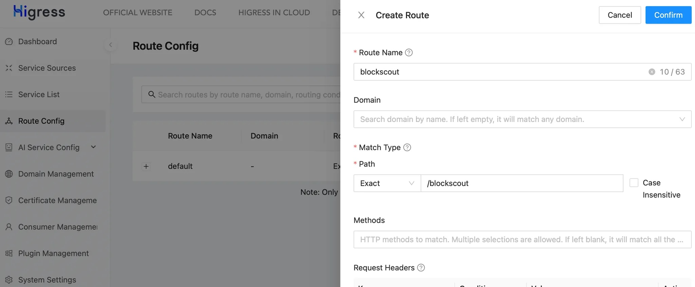

# Test MCP with local Higress

This guide describes how to install standalone Higress Gateway to test API-to-MCP server with MCP Server Plugin.

## 1. Install Higress

### 1.1. Clone the repo

```bash
git clone https://github.com/higress-group/higress-standalone.git higres
```

### 1.2. Configure server

```bash
cd higress
bin/configure.sh --use-builtin-nacos \
  --gateway-http-port=38080 --gateway-https-port=38443 --console-port=38000
```

## 2. Initial Higress configuration

### 2.1. Run the server

```bash
bin/startup.sh
```

### 2.2. Open the console

Access the Higress console via a browser at `http://localhost:38000/`. The first login requires setting up an administrator account (`admin`) and password.

## 3. Configure MCP endpoint

### 3.1. Configure Service Source


### 3.2. Create route





## 4. Add MCP server configuration

### 4.1. Add Strategy


### 4.2. Configure Plugin

Scroll through the list of plugins to "MCP server"


Enable the plugin and add the configuration


Below is the simplest plugin configuration to test functionality. To develop more sophisticated template use instructions: <https://higress.cn/en/ai/mcp-server/>.

```yaml
server:
  name: blockscout
tools:
  - name: eth-block-number
    description: |
      Get the latest block number.
    requestTemplate:
      url: "https://eth.blockscout.com/api?module=block&action=eth_block_number"
      method: GET
    responseTemplate:
      body: |
        # Latest ethereum mainnet block in hex:

        {{ .result }}
```

## 5. Test MCP server

### 5.1. Get the list of tools

```bash
curl -X POST http://localhost:38080/blockscout \
  -H "Content-Type: application/json" \
  -d '{"jsonrpc": "2.0","id": 1,"method": "tools/list"}'
```

```json
{
  "jsonrpc": "2.0",
  "id": 1,
  "result": {
    "nextCursor": "",
    "tools": [
      {
        "description": "Get the latest block number.\n",
        "inputSchema": { "properties": {}, "type": "object" },
        "name": "eth-block-number"
      }
    ]
  }
}
```

### 5.2. Call the tool

```bash
curl -X POST http://localhost:38080/blockscout \
  -H "Content-Type: application/json" \
  -d '{"method":"tools/call","params":{"name":"eth-block-number"}}'
```

```json
{
  "jsonrpc": "2.0",
  "id": 0,
  "result": {
    "content": [
      {
        "text": "# Latest ethereum mainnet block in hex:\n\n0x1574d8a",
        "type": "text"
      }
    ],
    "isError": false
  }
}
```

## 6. Use MCP server in Claude Desktop App

It is assuming that the current working directory still `higress`.

### 6.1. Extend Docker Compose File

Open `compose/docker-compose.yml` and insert the new service there:

```yaml
  mcp-remote:
    image: node:20-alpine
    profiles: ["manual"] 
    stdin_open: true
    tty: true
    volumes:
      - ${HOME}/.mcp-auth:/root/.mcp-auth
    networks:
      - higress-net
    command: ["sh", "-c", "sleep infinity"]
```

### 6.2. MCP Proxy Runner

To allow Claude communicate with the MCP server through `stdio` (the only method currently supported by Claude Desktop App, create a command simplifying running of `mcp-remote`. This is a kind of proxy MCP server which accepts requests by `stdio` and forwards them to a configured MCP server.

```bash
cp bin/status.sh bin/mcp-remote.sh
```

Open `bin/mcp-remote.sh` and update the last line in the script:

```bash
cd "$COMPOSE_ROOT" && COMPOSE_PROFILES="$COMPOSE_PROFILES" \
  runDockerCompose -p higress run --rm mcp-remote \
  npx -y mcp-remote http://gateway.svc/blockscout --transport http-only --allow-http
```

### 6.3. Configure Claude Desktop App

Open the app Settings and edit MCP server config file:

```json
{
  "mcpServers": {
    "higress": {
      "command": "/full/path/to/higress/bin/mcp-remote.sh",
      "args": []
    }
  }
}
```

Restart Claude Desktop App. In a new chat, the `higress` connection will appear:


If not, the following command (for MacOS/Linux) could help with debugging connection issues:

```bash
tail -n 20 -F ~/Library/Logs/Claude/mcp-server-higress.log
```

### 6.4. Prompt Claude to call the MCP server

Use the following prompt:

```text
What is the latest block number on Ethereum Mainnet?
```

The app will ask permissions to call the tool:


After granting permission, the MCP server will be requested for the latest block number. The final text generation could look like:


*Interesting fact: 0x157c38c is 22’528’908, not 22’691’980.*
